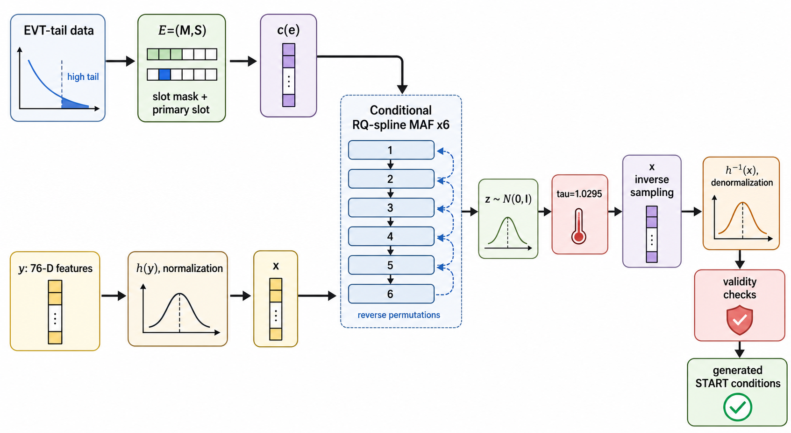

# highD 长尾驾驶事件归一化流

`normalizing/` 对 `process_highD/` 已筛出的 highD 长尾自然驾驶事件做条件密度建模，并从该分布中采样新的长尾事件初始状态。它不是 EVT 风险模型，也不重新判断一个片段是否属于长尾；输入数据已经全部来自上游 EVT-tail 事件集合。

当前只保留一个方法、一个配置和一个结果目录：

```text
normalizing/scripts/configs/highd_tail_flow_best.yaml
results/highd_tail_flow_best/
```

当前最佳方法是严格长尾条件有理二次样条掩码自回归流（strict EVT-tail conditional rational-quadratic spline MAF）。它配合稀有槽位加权负对数似然（rare-slot weighted NLL）、分阶段低学习率微调（staged fine-tuning）、按 `mask_pattern` 和 `primary_slot` 联合类别精确匹配的配额采样（exact quota sampling），并在隐空间使用采样温度 `tau = 1.0295` 做轻微扩散校准。

## 术语说明

文中英文缩写和关键词的中文含义如下。

| 术语 | 英文全称 | 中文说明 |
| --- | --- | --- |
| highD | highD naturalistic vehicle trajectory dataset | 德国高速公路无人机自然驾驶轨迹数据集。 |
| EVT | Extreme Value Theory | 极值理论。这里用于上游筛选高风险长尾自然驾驶事件。 |
| EVT-tail | EVT tail events | 已通过 EVT 极值尾部规则筛出的长尾事件集合。 |
| strict EVT-tail | strict tail-only modeling | 训练、验证、测试和采样评估都只使用 EVT-tail 样本，不混入普通驾驶片段。 |
| NF | Normalizing Flow | 归一化流；通过可逆变换把简单分布映射到复杂连续分布。 |
| MAF | Masked Autoregressive Flow | 掩码自回归流；逐维自回归地建模高维连续密度。 |
| RQ-spline | Rational-Quadratic Spline | 有理二次样条；一种可逆、分段单调、表达力强的非线性变换。 |
| NLL | Negative Log Likelihood | 负对数似然，常写作 `-log p(x)`；越低表示真实样本在模型下密度越高。 |
| weighted NLL | Weighted Negative Log Likelihood | 加权负对数似然；这里用于提高低频 slot 和低频事件结构的训练影响。 |
| stage | training stage | 训练阶段；完整训练不是一次跑完，而是按配置顺序运行多段训练，每段可使用不同学习率、早停耐心和输出目录。 |
| staged fine-tuning | staged low-learning-rate fine-tuning | 分阶段微调；先用较大学习率学到主要分布，再从前一阶段 checkpoint 继续用更小学习率细调 validation NLL。 |
| checkpoint | model checkpoint | 模型存档，包含网络权重、schema、标准化参数、特征变换和指标，可用于 resume 或评估采样。 |
| resume | resume training from checkpoint | 从已有 checkpoint 继续训练，而不是重新随机初始化模型。 |
| latent | latent variable | 归一化流的隐空间变量，当前基分布是 76 维标准高斯。 |
| temperature | sampling temperature | 采样温度；这里指隐空间高斯噪声的放大系数，当前为 `tau = 1.0295`。 |
| 参考划分 | reference split | 做分布对比和离散结构采样时作为真实基准的数据子集。它可以是训练集、验证集、测试集或全量集合；当前默认 `all`，即全量 2209 条 EVT-tail 样本。 |
| 配额采样 | quota sampling | 先统计参考划分中每个 `mask_pattern` 和 `primary_slot` 联合类别有多少条真实样本，再按这些类别配额生成样本。 |
| 精确配额 | exact quota | 当生成数量等于参考划分数量时，每个联合类别的生成条数与真实条数完全一致。 |
| `mask_pattern` | slot-mask bit pattern | 6 个 slot mask bit 的整数编码，表示哪些邻车语义槽位存在。 |
| `primary_slot` | primary interaction slot | EVT 风险峰值对应的主要交互车辆槽位。 |
| ADS | Automated Driving System | 自动驾驶系统；这里指后续场景测试系统。 |
| START | start condition for world model | 世界模型起始条件模式。 |
| GMM | Gaussian Mixture Model | 高斯混合模型，用作密度估计基线。 |
| RealNVP | Real-valued Non-Volume Preserving flow | 一类 coupling-flow 基线模型。 |
| KS | Kolmogorov-Smirnov statistic | 两样本边缘分布差异指标，越低越好。 |
| MAE | Mean Absolute Error | 平均绝对误差；这里用于相关矩阵误差。 |
| L1 | L1 distance | 绝对差之和；这里用于离散占用率分布误差。 |
| NPZ | NumPy compressed archive | NumPy 压缩数组文件。 |
| JSON | JavaScript Object Notation | 结构化文本数据文件。 |
| YAML | YAML Ain't Markup Language | 配置文件格式。 |
| CSV | Comma-Separated Values | 表格文本文件。 |
| fps | frames per second | 每秒帧数。当前 highD 预处理目标帧率为 25 fps。 |
| Hz | Hertz | 频率单位；25 Hz 等价于 25 fps。 |
| lr | learning rate | 学习率，控制优化器每步参数更新尺度。 |
| std | standard deviation | 标准差；这里用于训练划分上拟合的特征标准化。 |
| 76-D | 76-dimensional | 76 维。 |

## 快速运行

运行环境：

```bash
conda activate tread
```

从仓库根目录运行：

```bash
python normalizing/scripts/prepare_highd_tail_flow_dataset.py
python normalizing/scripts/train_highd_tail_flow.py
python normalizing/scripts/evaluate_highd_tail_flow.py
```

三个入口默认读取：

```text
normalizing/scripts/configs/highd_tail_flow_best.yaml
```

如果只想复用当前已保存的 best checkpoint 做评估和采样，直接运行：

```bash
python normalizing/scripts/evaluate_highd_tail_flow.py
```

完整重新训练会按 `training.stages` 依次训练 `density_fit -> likelihood_refinement -> final_refinement`。中间阶段会写到 `results/highd_tail_flow_best/stages/`；当前仓库只保留最终最佳结果。

## 数学建模

上游 `process_highD/` 已经完成 EVT-tail 筛选，因此 `normalizing/` 不再建模“一个自然驾驶片段是否属于长尾”。这里的统计对象是已经筛好的长尾数据集：

$$
\mathcal{D}_{\mathrm{tail}} = \{(e_i, y_i)\}_{i=1}^{N}.
$$

每个长尾样本拆成两个变量：

$$
E=(M,S), \qquad Y \in \mathbb{R}^{76}.
$$

其中 $E$ 是离散事件结构，$M \in \{0,1\}^{6}$ 是 6 个邻车 slot 的存在性 mask，$S \in \{0,\ldots,5\}$ 是 primary slot index，且有效样本应满足 $M_S=1$。$Y$ 是 76 维连续特征，包含 anchor 时刻 ego/邻车局部状态和每个活跃 slot 的未来 1 秒动作摘要。

本模块学习的是 $\mathcal{D}_{\mathrm{tail}}$ 诱导的长尾事件生成分布。更直接的分解是：

$$
\begin{aligned}
p_{\mathrm{tail}}(E=e, Y=y)
&= p_{\mathrm{tail}}(E=e)\,p_{\mathrm{tail}}(Y=y \mid E=e) \\
&\approx \hat{p}_{D}(E=e)\,p_{\theta}^{Y}(y \mid c(e)).
\end{aligned}
$$

其中 $\hat{p}_{D}(E=e)$ 是参考划分（reference split）中 $(\mathrm{mask\_pattern},\mathrm{primary\_slot})$ 联合类别的经验分布。这里的“参考划分”不是额外模型输入，而是评估和采样时选作真实分布基准的那部分 EVT-tail 数据。若参考划分记为 $\mathcal{D}_{\mathrm{ref}}$，则：

$$
\begin{aligned}
n_e
&= \sum_{(e_i,y_i)\in \mathcal{D}_{\mathrm{ref}}} \mathbf{1}[e_i=e], \\
\hat{p}_{D}(E=e)
&= \frac{n_e}{|\mathcal{D}_{\mathrm{ref}}|}.
\end{aligned}
$$

默认评估使用 $\mathcal{D}_{\mathrm{ref}}=\mathcal{D}_{\mathrm{tail}}$，所以生成 $2209$ 条样本时直接复现全量 EVT-tail 的离散结构计数。配额采样（quota sampling）的含义是：不先从 $\hat{p}_{D}$ 做多项式随机抽样，而是直接构造满足目标计数 $n_e$ 的离散结构序列。这样可以避免低频联合类别因为随机抽样波动而消失。只有选择多项式采样（multinomial sampling）时，才按 $\hat{p}_{D}(E)$ 随机抽取 $E$。

$c(e)$ 是 $12$ 维条件向量：

$$
c(e)=
\left[
m_0,\ldots,m_5,\;
\mathbf{1}[S=0],\ldots,\mathbf{1}[S=5]
\right] \in \{0,1\}^{12}.
$$

连续归一化流实际在模型坐标中建模连续条件密度。设原始可审计特征为 $y$，确定性特征变换为 $h(\cdot)$，训练划分上拟合的均值和标准差为 $\mu,\sigma$，令：

$$
\begin{aligned}
u &= h(y),\\
x &= (u-\mu)\oslash\sigma,\\
g(y) &= (h(y)-\mu)\oslash\sigma.
\end{aligned}
$$

这里 $\oslash$ 表示逐维除法。

模型直接学习的是 $p_{\theta}^{X}(x \mid c(e))$。如果需要写成原始物理坐标 $y$ 的密度，则有：

$$
\begin{aligned}
\log p_{\theta}^{Y}(y \mid c(e))
&= \log p_{\theta}^{X}(g(y) \mid c(e))
 + \log \left|\det \frac{\partial g(y)}{\partial y}\right|.
\end{aligned}
$$

当前报告的 NLL 是 $x$ 坐标下的连续密度 NLL，不包含 $g(\cdot)$ 的 Jacobian 项。这个数值适合同一特征定义、同一标准化、同一 split 下比较模型；如果要把它解释成原始物理坐标 $y$ 的绝对密度，需要额外加入上式的 Jacobian 项。

条件归一化流定义一个可逆映射：

$$
z=f_{\theta}(x;c), \qquad z \sim \mathcal{N}(0,I_{76}).
$$

因此模型坐标下的条件 log density 是：

$$
\begin{aligned}
\log p_{\theta}^{X}(x \mid c)
&= \log \phi\!\left(f_{\theta}(x;c)\right)
 + \log \left|\det \frac{\partial f_{\theta}(x;c)}{\partial x}\right|.
\end{aligned}
$$

其中 $\phi(\cdot)$ 是 76 维标准高斯密度。训练目标是样本加权负对数似然：

$$
\mathcal{L}(\theta)=\frac{\sum_i w_i\left[-\log p_{\theta}^{X}(x_i \mid c_i)\right]}{\sum_i w_i}.
$$

采样时先抽离散结构，再抽连续变量。配额采样模式下，先为每个离散类别 $e$ 确定目标配额 $q_e$，再构造满足配额的离散结构序列：

$$
K=|\mathcal{D}_{\mathrm{ref}}|,\qquad q_e=n_e,\qquad \operatorname{count}\{k:e_k=e\}=q_e.
$$

若使用多项式采样模式，则直接按经验离散分布抽取事件结构：

$$
e_k \sim \hat{p}_{D}(E).
$$

连续变量再由条件归一化流的逆变换生成：

$$
\begin{aligned}
z_k &\sim \mathcal{N}(0,\tau^2 I_{76}), \qquad \tau=1.0295,\\
x_k &= f_{\theta}^{-1}(z_k;c(e_k)),\\
y_k &= h^{-1}(\sigma \odot x_k+\mu).
\end{aligned}
$$

这里 $\odot$ 表示逐维乘法。

最后执行物理合法性检查，过滤非有限值、过大标准化坐标、前后车语义错误、左右车道语义错误、车辆框重叠和
$a_{\mathrm{mean},x}^{1s}-a_{\mathrm{min},x}^{1s}$ 语义错误。

## 建模范围

本模块学习的是已筛选 EVT-tail 数据集中的局部交通事件分布。公式中 $E$ 表示离散事件结构，$Y$ 表示局部状态和 1 秒动作摘要：

$$
E=(\mathrm{slot\_mask},\mathrm{primary\_slot}), \qquad Y \in \mathbb{R}^{76}.
$$

以下内容不作为归一化流的随机变量学习：

- EVT 风险分数和风险分层。所有样本已是 EVT-tail，风险只作为上游筛选和审计元数据。
- 车道拓扑，例如 `lane_count`、ego lane ordinal、左右车道是否存在。需要道路几何审计时应回到 `process_highD/` 的上游结果。
- 车辆尺寸和车道宽度。接口转换时使用 highD 默认常量。
- 完整未来轨迹。归一化流只生成 anchor 时刻局部状态和每个活跃交通车的 1 秒动作摘要，后续完整轨迹应由世界模型继续滚动生成。

因此，`normalizing/` 的角色不是替代世界模型，也不是替代 EVT 风险模型，而是为 ADS 长尾测试和世界模型 START 条件提供可采样、可审计的长尾初始交通条件。

## 数据集与特征设计

### 时间与坐标

每个样本来自一个 highD 自然驾驶长尾片段的 anchor 时刻。上游 `process_highD/` 当前配置为 $25$ Hz、$6$ 秒窗口；`normalizing/` 在 anchor 时刻抽取初始局部状态，并额外抽取 anchor 后 $1$ 秒内的邻车动作摘要。

坐标约定：

- `process_highD` 会对 highD 中反向行驶的车辆做行驶方向统一：对 `drivingDirection == 1` 的轨迹执行 $x\mapsto -x$、$v_x\mapsto -v_x$、$a_x\mapsto -a_x$，使所有样本的 ego 前进方向都变成 $+x$。
- 这种处理是纵向行驶方向归一化，不是左右车道的数据增强；它不允许把 ego 右侧车辆变成左侧车辆，也不允许把左侧车辆变成右侧车辆。
- 名称里带 `_left` 的量使用 ego 物理左侧为正方向。代码用 `_lateral_sign` 把 highD 图像坐标的横向差值转换成“ego 左侧为正”的坐标。
- $\mathrm{rel\_x\_m}>0$ 表示邻车在 ego 前方，$\mathrm{rel\_x\_m}<0$ 表示邻车在 ego 后方。
- `left_*` slot 应满足 $\mathrm{rel\_y\_left\_m}>0$，`right_*` slot 应满足 $\mathrm{rel\_y\_left\_m}<0$。
- 换言之，镜像或翻转只用于统一车辆前进方向；统一之后，在 ego 右侧车道的车仍必须编码为 `right_front` 或 `right_rear`，在 ego 左侧车道的车仍必须编码为 `left_front` 或 `left_rear`。后续物理检查也会拒绝 `left_*` 横向坐标非正、`right_*` 横向坐标非负的样本。
- 当前代码不做左右互换式数据增强，因此左右侧样本不被强行合并，数据中的真实左右不均衡会保留在训练和评估中。

对应实现是：`process_highD/src/preprocess.py` 的 `normalize_driving_direction` 只翻转纵向 $x$ 坐标、纵向速度和纵向加速度；`process_highD/src/natural_segments.py` 的 `_lateral_sign` 和 `_adjacent_lanes_ego_left` 负责把车道关系解释成 ego 左/右；`normalizing/src/metrics.py` 会在生成后检查 `left_*` 与 `right_*` 的横向符号是否满足上述拓扑约束。

### 离散事件结构

slot 顺序固定为：

```text
same_front
same_rear
left_front
left_rear
right_front
right_rear
```

离散条件向量是 12 维：

```text
mask_same_front ... mask_right_rear
primary_slot_same_front ... primary_slot_right_rear
```

`slot_mask` 表示 anchor 时刻该语义 slot 是否有交通车。`primary_slot` 来自 EVT peak interaction object，即风险峰值对应的主要交互对象；但连续特征仍覆盖所有活跃 slot，不只覆盖 primary vehicle。

`mask_pattern` 是 6 个 mask bit 的整数编码：

$$
\mathrm{mask\_pattern}=\sum_{i=0}^{5} m_i\,2^i.
$$

它只用于分组、配额采样和可视化，不代表连续物理大小。

### `primary_slot` 是否必要？

`primary_slot` 对场景复现不是单独充分条件。只知道 $\mathrm{primary\_slot}=\mathrm{left\_front}$，并不能知道 `same_front`、`same_rear`、`right_front` 等其他车辆是否存在，也不能确定所有车辆的连续状态。因此完整场景结构必须由 `slot_mask` 和 `primary_slot` 一起描述。

但 `primary_slot` 对长尾事件复现是必要的。EVT 事件的风险峰值通常由某一个最关键邻车触发；如果只保留 `slot_mask`，同一种占用结构下的不同主导交互会被混在一起，模型会丢失“这个长尾事件主要由哪个对象触发”的语义。当前精确配额采样也按 $(\mathrm{mask\_pattern},\mathrm{primary\_slot})$ 联合类别匹配真实计数，目的就是同时复现交通参与者结构和主导风险对象结构。

对后续 ADS 测试来说，如果某个测试只需要物理可行的多车初始化，`primary_slot` 可以不作为仿真器的强制输入；但如果测试目标是复现 EVT-tail 的风险机制、选择重点交互对象或给世界模型标注主交互车辆，则应保留 `primary_slot`。

### 76 维连续特征向量

当前连续目标向量是 76 维，即 $4 + 6\times 6 + 6\times 6 = 76$。

Ego 动力学 4 维：

| feature | 含义 |
| --- | --- |
| `ego_vx_mps` | anchor 时刻 ego 纵向速度，前进方向为正。 |
| `ego_vy_left_mps` | anchor 时刻 ego 横向速度，物理左侧为正。 |
| `ego_ax_mps2` | anchor 时刻 ego 纵向加速度。 |
| `ego_ay_left_mps2` | anchor 时刻 ego 横向加速度，物理左侧为正。 |

每个 slot 的 anchor 局部状态 6 维，共 36 维：

| feature pattern | 含义 |
| --- | --- |
| `<slot>_rel_x_m` | 邻车相对 ego 的纵向位置，前方为正，后方为负。 |
| `<slot>_rel_y_left_m` | 邻车相对 ego 的横向位置，物理左侧为正。 |
| `<slot>_rel_vx_mps` | 邻车纵向速度减 ego 纵向速度；正值表示邻车纵向速度更大。 |
| `<slot>_rel_vy_left_mps` | 邻车横向速度减 ego 横向速度，左向为正。 |
| `<slot>_other_ax_mps2` | 邻车自身纵向加速度，不减 ego 加速度。 |
| `<slot>_other_ay_left_mps2` | 邻车自身横向加速度，左向为正，不减 ego 加速度。 |

每个 slot 的未来 1 秒动作摘要 6 维，共 36 维：

| feature pattern | 含义 |
| --- | --- |
| `<slot>_delta_vx_1s_mps` | 邻车从 anchor 到 1 秒后的纵向速度变化。 |
| `<slot>_delta_vy_left_1s_mps` | 邻车从 anchor 到 1 秒后的横向速度变化，左向为正。 |
| `<slot>_mean_ax_1s_mps2` | 邻车未来 1 秒窗口内纵向加速度均值。 |
| `<slot>_min_ax_1s_mps2` | 邻车未来 1 秒窗口内最小纵向加速度，刻画最强制动趋势。 |
| `<slot>_final_ax_1s_mps2` | 邻车 1 秒末端纵向加速度，刻画动作 endpoint。 |
| `<slot>_mean_ay_left_1s_mps2` | 邻车未来 1 秒窗口内横向加速度均值，左向为正。 |

`final_ax_1s_mps2` 替代了旧的 `braking_duration_1s`。后者是阈值累计量，台阶明显，不适合连续归一化流；`final_ax_1s_mps2` 更适合作为世界模型第一秒动作趋势的末端状态。

非活跃 slot 的固定宽度占位值是 $0$。读取数据时必须使用 `slot_mask` 和 `feature_valid` 判断有效性，不能把非活跃 slot 的 $0$ 当成真实车辆状态。

### 特征坐标

训练前先做确定性特征变换，再在训练划分上拟合 $\mu/\sigma$ 标准化。当前实际使用的模型坐标变换只有两类：

```text
identity:                              70
positive_mean_minus_min_ax_softplus:    6
```

`positive_mean_minus_min_ax_softplus` 只作用于每个 slot 的 `min_ax_1s_mps2`。它把物理约束：

$$
a_{\mathrm{mean},x}^{1s} - a_{\mathrm{min},x}^{1s} \ge 0
$$

写成 unconstrained 坐标中的 softplus gap。逆变换采样时恢复：

$$
\begin{aligned}
\Delta a_x^{1s} &= \operatorname{softplus}(r),\\
a_{\mathrm{min},x}^{1s}
&= a_{\mathrm{mean},x}^{1s} - \Delta a_x^{1s}.
\end{aligned}
$$

过去尝试过的纵向 log-gap 变换没有进入当前最佳方法。

## 网络结构

当前唯一保留的主模型：

```text
conditional Masked Autoregressive Flow
rational-quadratic spline autoregressive transform
6 autoregressive layers
160 hidden features
2 residual blocks per transform
8 spline bins
tail bound 4.0
dropout 0.02
batch norm disabled
base distribution: StandardNormal(76)
context dimension: 12
```

网络输入、条件和隐空间之间的关系可以写成：

$$
y \to x,\qquad
c(e)=\operatorname{onehot}(M,S),\qquad
x \to z.
$$

网络结构图如下：



图片文件保存在 `normalizing/assets/normalizing_flow_structure.png`，用于 README 和论文草稿中的结构说明。

图中上方分支是离散事件结构：$E=(M,S)$ 由 slot mask 和 primary slot 组成，并编码成条件向量 $c(e)$。下方分支是连续交通状态：原始 76 维特征 $y$ 先经过确定性变换 $h(\cdot)$ 和训练集均值/标准差归一化，得到模型坐标 $x$。中间的条件有理二次样条 MAF 由 6 个自回归变换块组成，每个块都接收同一个条件向量 $c(e)$。正向计算时，模型把 $x$ 映射到标准高斯隐变量 $z$ 并计算似然；反向采样时，先从带温度的隐空间采样，再通过逆变换生成连续特征，最后做物理合法性检查并形成 START 初始条件。

每个 MAF 变换块内部是自回归变换：第 $j$ 维的样条参数由前序维度和条件向量共同决定。RQ-spline 变换保持单调可逆，因此既能从 $x$ 正向映射到 $z$ 计算似然，也能从 $z$ 逆向映射到 $x$ 做采样。

导出样本时记录联合对数概率。设 $J$ 表示 `joint_log_prob`，$L_x$ 表示 `conditional_log_prob`，$L_e$ 表示 `event_structure_log_prob`，则：

$$
J=L_x+L_e=\log p_{\theta}^{X}(x \mid c(e))+\log \hat{p}_{D}(e).
$$

## 训练流程

训练入口：

```bash
python normalizing/scripts/train_highd_tail_flow.py
```

配置中的 `training.stages` 是完整训练链：

```text
density_fit             lr = 5e-4,  max_epochs = 240
likelihood_refinement   lr = 1e-5,  max_epochs = 180
final_refinement        lr = 5e-7,  max_epochs = 260
```

这些阶段名称描述训练目的，不把学习率或实验序号塞进名称里。它们不是新的模型类别；三段训练使用同一个条件 RQ-spline MAF，只是优化步长和早停策略不同。

| stage name | 中文含义 | 作用 |
| --- | --- | --- |
| `density_fit` | 主体密度拟合阶段 | 用 rare-slot weighted NLL 和 `lr = 5e-4` 从随机初始化开始训练，先学习 EVT-tail 条件密度的主要形状。 |
| `likelihood_refinement` | 似然细化阶段 | 从 `density_fit` 的 best checkpoint 继续训练，把学习率降到 `lr = 1e-5`，重点细化 held-out validation NLL。 |
| `final_refinement` | 最终细化阶段 | 从 `likelihood_refinement` 继续训练，把学习率进一步降到 `lr = 5e-7`，做最后的小步长收敛；最终保留的 checkpoint 仍按 validation NLL 最低选择。 |

完整训练时，前两个中间阶段分别写入：

```text
results/highd_tail_flow_best/stages/density_fit/
results/highd_tail_flow_best/stages/likelihood_refinement/
```

这些目录用于保存中间 checkpoint、`training_history.csv` 和 `training_summary.json`，使后一阶段可以通过 `resume_from_stage` 接上前一阶段的 best checkpoint。当前整理后的 baseline 只把 `final_refinement` 阶段输出作为唯一正式结果，因此仓库主结果目录是：

```text
results/highd_tail_flow_best/
```

模型存档选择标准是不加权的严格长尾验证 NLL。最终阶段从 $-88.3093$ 继续改善到 $-88.3726$，在第 $230$ 个 epoch 停止。

训练损失使用样本加权 NLL：

$$
\mathrm{loss}=\frac{\sum_i w_i\,\mathrm{NLL}_i}{\sum_i w_i}.
$$

样本权重由四类因素相乘后裁剪得到：

$$
\begin{aligned}
w_i &=
\operatorname{clip}
\left(
  \operatorname{normalize}
  \left(
    q_i^{\mathrm{slot}}\,
    q_i^{\mathrm{mask}}\,
    q_i^{\mathrm{primary}}\,
    q_i^{\mathrm{target}}
  \right),
  0.60,
  2.50
\right).
\end{aligned}
$$

其中 $q_i^{\mathrm{slot}}$、$q_i^{\mathrm{mask}}$、$q_i^{\mathrm{primary}}$ 和 $q_i^{\mathrm{target}}$ 分别对应 slot active inverse-frequency、mask-pattern inverse-frequency、primary-slot inverse-frequency 和 targeted slot multiplier。

当前配置：

- slot active inverse frequency，power $0.35$
- mask-pattern inverse frequency，power $0.10$
- primary-slot inverse frequency，power $0.05$
- targeted multipliers:
  $\mathrm{same\_rear}=1.15$，
  $\mathrm{left\_front}=1.25$，
  $\mathrm{left\_rear}=1.60$，
  $\mathrm{right\_rear}=1.10$

权重按训练划分均值归一化。这样低频侧后方和侧前方事件对似然的影响不会被高频 `same_front`、`right_front` 场景淹没。

## 采样流程

评估入口：

```bash
python normalizing/scripts/evaluate_highd_tail_flow.py
```

当前默认采样策略：

```text
event_structure_sampling: quota
sampling_temperature: 1.0295
sampling_max_rounds: 80
sampling_oversample_factor: 1
sampling_min_draw: 1
reject_invalid_samples: true
```

这里的参考划分（reference split）由配置项 `distribution_reference_split` 指定，表示“用哪一部分真实 EVT-tail 数据作为分布对比和离散结构计数的基准”。当前参考划分是 `all`，即全量 $2209$ 条长尾样本。

配额采样（quota sampling）会按参考划分中的 $(\mathrm{mask\_pattern},\mathrm{primary\_slot})$ 联合类别逐类填满生成数量。当前生成数也等于 $2209$，因此每个联合类别的生成条数与真实条数完全一致，mask 占用率和 primary-slot 占用率的 L1 误差为 $0$。

连续隐空间采样使用温度 $\tau=1.0295$：

$$
z_{\mathrm{sample}}=\tau\,z_{\mathrm{standard}}, \qquad \tau=1.0295.
$$

采样后做逆标准化和逆特征变换，再执行物理拒绝采样。当前拒绝检查覆盖：

- 非有限值
- 归一化坐标过大
- 前后车纵向关系符号错误
- 左右车道语义错误
- ego 与邻车重叠
- $a_{\mathrm{mean},x}^{1s}-a_{\mathrm{min},x}^{1s}$ 语义错误

最终保留样本的非法率、重叠率、负间隙率和语义错误率都为 $0$。

ADS 测试阶段的采样次数通常由测试计划决定，不一定等于 $2209$。因此 README 不把 ADS-facing interface payload 作为固定 baseline 输出契约；后续真实 ADS 测试应按所需 `num_samples` 即时采样并即时转换接口。

## 脚本说明

### `prepare_highd_tail_flow_dataset.py`

作用：从上游 EVT-tail 条件上下文和 highD 原始轨迹中构建归一化流数据集。

主要输入：

- `--config`：默认 `normalizing/scripts/configs/highd_tail_flow_best.yaml`。
- `paths.highd_evt_config`：上游 highD EVT 配置。
- `paths.raw_dir`：highD 原始数据目录。
- `paths.tail_context_csv`：上游筛出的 EVT-tail context CSV。
- `--rebuild-tail-contexts`：如果需要，先重新调用上游 EVT tail context 选择逻辑。

主要输出：

- `results/highd_tail_flow_best/dataset.npz`：包含 `features`、`features_normalized`、`feature_valid`、`contexts`、`slot_mask`、`mask_pattern`、`split_index`、metadata 等数组。
- `results/highd_tail_flow_best/dataset_schema.json`：包含特征名、条件向量名、slot 名、标准化参数、划分摘要、mask pattern 摘要和特征变换类型。

### `train_highd_tail_flow.py`

作用：分阶段训练条件 RQ-spline MAF。

主要输入：

- `--config`：训练配置。
- `dataset.npz` 和 `dataset_schema.json`：若不存在或 schema 过期，会自动重建。
- `--no-tensorboard`：关闭 TensorBoard。
- `--tensorboard-log-dir`：指定 TensorBoard 目录。
- `--clear-tensorboard`：清理已有 TensorBoard event 文件。

主要输出：

- `checkpoints/best_tail_conditional_maf.pt`：验证 NLL 最优的模型存档。
- `training_history.csv`：每个 epoch 的训练 NLL、验证 NLL 和学习率。
- `training_summary.json`：模型存档、最优验证 NLL、训练轮数、样本加权摘要和续训信息。
- 完整重新训练时，每个阶段也会在 `results/highd_tail_flow_best/stages/` 下写出自己的模型存档和训练摘要。

### `evaluate_highd_tail_flow.py`

作用：加载模型存档，计算留出数据 NLL，对比基线密度模型，生成诊断样本，计算分布复现指标，并画诊断图。

主要输入：

- `--config`：评估配置。
- `--checkpoint`：可选；默认使用 `checkpoints/best_tail_conditional_maf.pt`。
- `--num-samples`：可选；默认匹配参考划分的样本数。
- `--output-prefix`：采样 NPZ 文件名前缀。
- `--sampling-temperature`：覆盖配置中的隐空间采样温度。
- `--skip-baselines`：跳过 Gaussian、GMM、Copula、RealNVP 基线。
- `--skip-figures`：跳过诊断图生成。

主要输出：

- `evaluation_summary.json`：NLL、基线对比、采样数、分布复现指标、物理合法性、占用率和拒绝率。
- `diagnostics/nll_comparison.csv`：主模型和基线的 train/val/test NLL。
- `diagnostics/feature_distribution_metrics.csv`：逐特征 KS、Wasserstein、均值差异等。
- `diagnostics/slot_distribution_metrics.csv`：按 slot 聚合的分布误差。
- `diagnostics/joint_probability_scores.csv`：联合概率诊断。
- `figures/*.png`：边缘分布、相关性、joint probability、occupancy 和 NLL 诊断图。
- `samples/<output-prefix>.npz`：用于本次评估诊断的生成样本数组；它不是固定 ADS 测试样本集合。

## 评价指标

NLL 是连续密度的 $-\log p(x)$。连续密度可以大于 $1$，所以 NLL 可以为负。NLL 只应在相同特征坐标、相同 split、相同数据定义下比较。

当前 best checkpoint：

```text
results/highd_tail_flow_best/checkpoints/best_tail_conditional_maf.pt
```

留出数据上的条件 NLL：

```text
conditional rq-spline MAF    train -147.0504  val -88.3726  test -106.0621
GMM                          train -125.6069  val -43.3915  test  -65.9791
Gaussian                     train    1.4248  val  16.2438  test    6.7505
Copula                       train   30.3386  val  36.5070  test   32.6475
Unconditional RealNVP        train   78.3462  val  81.3035  test   79.1450
```

$2209$ 条真实样本与 $2209$ 条生成样本的 EVT-tail 复现指标：

```text
mean per-feature KS:          0.0928
mean Wasserstein:             0.3126
Pearson corr MAE:             0.0419
mask occupancy L1:            0.0000
primary-slot occupancy L1:    0.0000
invalid_rate:                 0.0000
overlap_rate:                 0.0000
negative_gap_rate:            0.0000
semantic_error_rate:          0.0000
sampling rejection_rate:      0.1421
```

Slot-wise mean KS：

```text
same_front  0.0390
same_rear   0.0726
left_front  0.1392
left_rear   0.1455
right_front 0.0518
right_rear  0.1082
```

相对上一版低学习率细化基线，当前方法改善 test NLL、mean KS、mean Wasserstein 和 corr MAE；代价是拒绝率从 $0.1408$ 升至 $0.1421$。拒绝采样后物理合法性仍为 $0$ error。

## 输出文件约定

当前 baseline 结果目录的核心文件：

```text
results/highd_tail_flow_best/
  checkpoints/best_tail_conditional_maf.pt
  dataset.npz
  dataset_schema.json
  training_history.csv
  training_summary.json
  evaluation_summary.json
  experiment_report.md
  diagnostics/nll_comparison.csv
  diagnostics/feature_distribution_metrics.csv
  diagnostics/slot_distribution_metrics.csv
  diagnostics/joint_probability_scores.csv
  figures/tail_c0_marginal_distributions.png
  figures/tail_c0_all_marginal_distributions.png
  figures/tail_c0_all_feature_distribution_errors.png
  figures/tail_c0_joint_probability_tail_vs_generated.png
  figures/tail_c0_correlation_tail_vs_generated.png
  figures/tail_c0_all_correlation_tail_vs_generated.png
  figures/tail_c0_probability_diagnostics.png
  figures/tail_c0_context_occupancy_tail_vs_generated.png
  samples/generated_samples.npz
```

`samples/generated_samples.npz` 是当前评估报告使用的等量诊断样本。真实 ADS 测试不应假设这个固定文件就是最终测试样本；应在测试阶段按所需样本数重新采样。

## ADS 与世界模型使用方式

归一化流生成的是 START 条件所需的局部状态和 1 秒动作摘要，不生成完整未来轨迹。下游应使用：

- ego 初始速度、加速度和局部坐标原点。
- 所有活跃背景车的相对位置、相对速度和自身加速度。
- 所有活跃交通车 slot 的 `action_1s_summary`，包括 `delta_vx`、`delta_vy_left`、`mean_ax`、`min_ax`、`final_ax`、`mean_ay_left`。
- `primary_slot` 作为主交互车辆标注，而不是唯一需要仿真的车辆。

世界模型应优先读取所有活跃 slot 的第一秒动作摘要；primary summary 只是主交互对象的便捷索引。

这些接口对象应该由后续 ADS 测试脚本在采样时按需转换，而不是作为本 baseline README 的固定样本清单。

## 代码结构

入口脚本：

- `scripts/prepare_highd_tail_flow_dataset.py`：构建 `dataset.npz` 和 `dataset_schema.json`。
- `scripts/train_highd_tail_flow.py`：训练分阶段条件 MAF。
- `scripts/evaluate_highd_tail_flow.py`：计算 NLL、baseline、采样、物理指标和诊断图。

核心模块：

- `src/features.py`：从 highD 片段提取 76 维特征和 slot 元数据。
- `src/data.py`：长尾条件上下文读取、recording 预处理、数据划分、条件向量构建、标准化和 dataset/schema 写入。
- `src/transforms.py`：当前只保留 $a_{\mathrm{mean},x}^{1s}-a_{\mathrm{min},x}^{1s}$ softplus gap 变换。
- `src/model.py`：conditional MAF、RealNVP baseline、checkpoint load/save。
- `src/train.py`：样本加权、单阶段训练、分阶段训练调度。
- `src/sampling.py`：离散事件结构采样、配额计划、归一化流采样、物理拒绝采样、接口转换函数。
- `src/metrics.py`：条件 NLL、分布指标、占用率指标、物理合法性。
- `src/baselines.py`：Gaussian、GMM、Gaussian copula、unconditional RealNVP baseline NLL。
- `src/evaluation.py`：评估总流程和 `evaluation_summary.json` 写入。
- `src/visualization.py`：边缘分布、相关性、joint probability 和 occupancy 图。
- `src/utils.py`：路径、日志、JSON/YAML、seed、device 工具。

## 左侧槽位误差分析

当前主要误差集中在 `left_front` 和 `left_rear`，这首先是数据分布不均衡问题，不是代码把左侧镜像坏了。当前 $2209$ 条 EVT-tail 样本中，各 slot active count 是：

```text
same_front  2138  96.79%
same_rear    854  38.66%
left_front   500  22.63%
left_rear    217   9.82%
right_front 1993  90.22%
right_rear   824  37.30%
```

primary slot 更不均衡：

```text
same_front  1581  71.57%
same_rear    443  20.05%
left_front    86   3.89%
left_rear     12   0.54%
right_front   63   2.85%
right_rear    24   1.09%
```

训练 split 中 `left_rear` active 只有 $146$ 条，primary `left_rear` 只有 $9$ 条；test split 中 active `left_rear` 只有 $30$ 条，primary `left_rear` 只有 $2$ 条。这种极低样本量会让条件密度估计和 KS 统计都更不稳定。

代码层面，`process_highD` 会把行驶方向统一到 $+x$，`normalizing` 会用 `_lateral_sign` 把横向坐标转成“ego 左侧为正”。这个步骤只保证两个行驶方向的数据进入同一个前进方向坐标系，不交换左右槽位；在 ego 右侧车道的车仍应是 `right_front` 或 `right_rear`，在 ego 左侧车道的车仍应是 `left_front` 或 `left_rear`。因此 `left_front`、`left_rear` 与 `right_front`、`right_rear` 的差异更主要反映 highD 车道可用性、驾驶行为、EVT 筛选和 slot 频率共同造成的数据不均衡，而不是左右拓扑被镜像破坏。

需要注意的是，`right_rear` 的 Wasserstein 误差也不低，说明误差不只来自 “left” 这个方向本身；低频 slot、侧向交互、纵向相对距离和 1 秒动作摘要的组合都会增加拟合难度。当前加权 NLL 已经对 `left_front` 和 `left_rear` 提高权重，但不能凭空补足极低 primary 样本数量。后续如果要继续改善，应优先考虑按车道拓扑分层、对低频 primary slot 做更强的条件重采样校准，或在严格保持左右槽位同步交换和拓扑校验的前提下再讨论额外数据增强。

## 剩余问题

当前主要剩余问题：

- `left_rear` 和 `left_front` 的 1 秒动作摘要边缘分布仍最难拟合。
- 各 slot 的纵向相对距离 `rel_x_m` Wasserstein 误差仍值得继续压低。
- temperature $\tau=1.0295$ 带来的 rejection rate 为 $0.1421$。

后续改进应优先降低低频侧向 slot 的 KS，同时保持下列指标约束。这里
$\mathrm{L1}_{\mathrm{mask}}$ 表示 mask occupancy L1，
$\mathrm{L1}_{\mathrm{primary}}$ 表示 primary-slot occupancy L1：

$$
\begin{aligned}
\mathrm{NLL}_{\mathrm{test}} &< -106.0621,\\
\mathrm{KS}_{\mathrm{mean}} &< 0.0928,\\
\mathrm{L1}_{\mathrm{mask}} &= 0.0000,\\
\mathrm{L1}_{\mathrm{primary}} &= 0.0000,\\
\mathrm{Err}_{\mathrm{physical}} &= 0.0000.
\end{aligned}
$$
